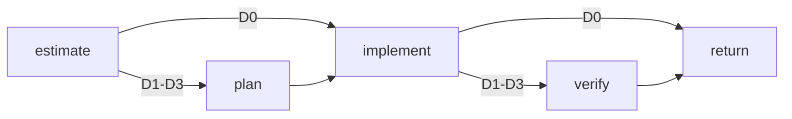

# Phenix definition Markdown

Bundled Phenix agents and workflows are authored as constrained Markdown and compiled into typed `AgentDefinition` and `WorkflowDefinition` runtime objects.

Markdown is the authoring surface. Compiled definitions, schemas, graph validation, capability enforcement, and run-scoped routing remain execution authority. Mermaid is explanatory and never authoritative.

## Design rules

1. Every definition declares a stable ID and explicit input/output schema IDs.
2. Agent prompts remain static instructions; task data is supplied through the input schema.
3. Tools, context, child capabilities, limits, and model routes are structured metadata.
4. Workflow states invoke public agent or workflow definitions through typed boundaries.
5. Transition tables are authoritative; Mermaid diagrams are for readers.
6. Difficulty is run-scoped data. It is never inferred inside provider adapters or stored as mutable workflow-global state.
7. Difficulty describes architectural risk and reasoning complexity, not expected wall-clock duration.
8. Session and workflow timeouts are opt-in. Bundled Phenix definitions omit them by default.
9. Arbitrary expressions, JavaScript, shell expansion, and prompt-granted permissions are not supported.

## Agent format

````md
# Repository scout

```phenix-agent
id: agent.scout
description: Answer a focused repository question with path-grounded evidence.
input: request.scout
output: outcome.scout-report
model: session
thinking: route
persistence: memory
```

## Models

| Difficulty | Model | Capability | Thinking |
|---|---|---|---|
| `D0` | `session` | `fast` | `minimal` |
| `D1` | `session` | `general` | `low` |
| `D2` | `session` | `reasoning` | `medium` |
| `D3` | `session` | `reasoning` | `high` |

## Tools

```phenix-tools
allow: read, grep, find, ls, phenix_present
```

## Context

```phenix-context
project-files: inherit
parent-conversation: none
artifacts:
max-bytes: 64000
```

## Children

```phenix-children
allow:
max-depth: 4
may-detach: false
may-send: false
may-cancel-children: false
```

## Limits

```phenix-limits
max-repair-attempts: 1
```

## Prompt

Act as a read-only repository scout. Search narrowly, cite concrete paths and lines, distinguish evidence from inference, and do not edit files.
````

The compiler resolves both schema IDs, validates every field and enum, and produces the effective runtime definition directly. There is no secondary TypeScript policy overlay for agents that declare a model table.

### Model syntax

- `session` — resolve through the owning session's model set.
- `phenix:<set>` — select a named virtual Phenix model set.
- `<provider>/<model>` — select a concrete provider model.

### Difficulty model table

`## Models` is optional. When present it must contain exactly one row for each of `D0`, `D1`, `D2`, and `D3`.

| Column | Meaning |
|---|---|
| `Difficulty` | The effective run difficulty. |
| `Model` | A model selector using the syntax above. |
| `Capability` | The provider-independent pool capability, such as `code`, `reasoning-max`, or `review`. |
| `Thinking` | A concrete Pi thinking level. `route` is not allowed in this table. |

The execution application layer selects one row. The provider resolver receives only the selected model, capability, thinking level, and difficulty. It does not inspect workflow graphs or Markdown.

### Limits and timeouts

`timeout-ms` is optional for both agents and workflows. Omitting it means the session or workflow has no wall-clock deadline; the compiler represents this as the canonical unbounded value `timeoutMs: 0`.

Bundled Phenix routing, agents, stock sessions, and workflows omit `timeout-ms`. Difficulty estimation must not manufacture a deadline: a build, dependency fetch, provider response, or other legitimate operation may take longer than expected without making the enclosing session invalid.

A definition may still opt in when a real wall-clock requirement exists:

```phenix-limits
timeout-ms: 300000
max-repair-attempts: 1
```

This deadline covers the enclosing agent or workflow and should therefore be used deliberately. Prefer operation-specific or tool-specific timeouts for commands and external effects. For example, `nix_shell` accepts its own bounded `timeoutMs` and `indexTimeoutMs` values independently of the session lifetime.

Turn, tool-call, repair, node-run, retry, and parallelism limits remain available independently of wall-clock duration. They constrain execution shape without assuming how long valid work should take.

### Lists

Tool names, artifacts, and invokable child definitions use comma-separated values. An empty value declares an empty list.

## Difficulty estimator

Difficulty estimation is implemented as an ordinary typed agent. Its Markdown prompt contains a small decision flowchart and rubric; its output schema is:

```ts
{
  difficulty: "D0" | "D1" | "D2" | "D3";
  summary: string;
  signals: string[];
}
```

The estimator has no repository tools and does not solve the task. Workflows decide whether to invoke it and how to consume its result. A workflow such as QA may instead pin strong routes directly. The estimate captures risk and reasoning complexity, not expected execution time.

## Workflow format

````md
# Difficulty-aware implementation

```phenix-workflow
id: workflow.example
input: request.implementation
output: outcome.implementation-result
entry: estimate
max-node-runs: 12
max-parallelism: 1
```

## Flow



## States

### estimate

```phenix-state
kind: invoke
run: agent.difficulty-estimator
input: difficulty.input
input-schema: request.difficulty-assessment
output-schema: outcome.difficulty-assessment
wait: await
difficulty: D0
retry: retryable
max-retries: 1
```

### plan

```phenix-state
kind: invoke
run: agent.planner
input: example.plan.input
input-schema: request.plan
output-schema: outcome.plan
wait: await
difficulty: result:estimate
```

### implement

```phenix-state
kind: invoke
run: agent.implementer
input: example.implement.input
input-schema: request.implementation
output-schema: outcome.change-set
wait: await
difficulty: result:estimate
```

### verify

```phenix-state
kind: invoke
run: agent.verifier
input: example.verify.input
input-schema: request.verification
output-schema: outcome.verification
wait: await
difficulty: result:estimate
retry: retryable
max-retries: 1
```

### return

```phenix-state
kind: return
output: example.output
output-schema: outcome.implementation-result
```

## Transitions

| From | To | When | Max traversals |
|---|---|---|---|
| `estimate` | `implement` | `difficulty.D0` | |
| `estimate` | `plan` | `difficulty.at-least-D1` | |
| `plan` | `implement` | | |
| `implement` | `return` | `difficulty.D0` | |
| `implement` | `verify` | `difficulty.at-least-D1` | |
| `verify` | `return` | | |
````

## Invoke difficulty binding

An `invoke` state may declare one of three policies:

- Omitted — inherit the parent run's effective difficulty.
- `difficulty: D3` — pin this invocation to a fixed route. QA uses this for architecture, security, and synthesis.
- `difficulty: result:estimate` — read the validated `difficulty` field from a successful earlier state result.

The compiler verifies that a result-bound state exists and is not self-referential. The workflow process manager extracts the validated difficulty and passes it through the child invocation boundary. The execution facade persists it in the child's compiled run specification.

## Invoke recovery

An awaited `invoke` state may declare bounded recovery:

```phenix-state
kind: invoke
run: agent.critic
input: qa.security.input
input-schema: request.critic
output-schema: outcome.critic-report
wait: await
retry: retryable
max-retries: 1
```

`retry: retryable` means that only a child failure explicitly marked `retryable: true` may create a replacement attempt. `max-retries` counts replacement attempts after the initial run and must be a positive integer.

Recovery belongs to the original workflow activation:

- completed sibling states and their typed results remain authoritative;
- the failed attempt remains immutable and the replacement records `retryOf`;
- the replacement retains the original workflow node and activation causation;
- validated `suggestedLimits` from a failure may adjust the replacement's explicitly bounded agent limits;
- the state completes only after the final successful or exhausted attempt;
- joins evaluate the activation's final outcome rather than every historical attempt.

Background invocations cannot declare recovery because the workflow has already advanced. Side-effecting states should omit automatic retry unless their operation is explicitly idempotent. Production implementation workflows therefore retry estimator, planner, and verifier states but not the implementer state.

Intermediate workflow-child failures remain diagnostic events, but presentation is owned by the workflow supervisor. The root receives a compact retry notice and only sees an error if the workflow exhausts its recovery policy.

## State contracts

### `invoke`

An invoked state declares the mapping used to construct the child input and the expected child schemas. The compiler rejects schema mismatches.

### `local`

A deterministic local operation declares input and output schemas:

```phenix-state
kind: local
operation: local.qa-checks
input: qa.checks.input
input-schema: request.qa-checks
output-schema: outcome.check-results
```

Local operation implementations remain separately registered runtime authorities. Their command or effect deadlines belong to the operation implementation rather than being inferred from the enclosing workflow's difficulty.

### `decision`

A decision evaluates a registered pure function. Outgoing edge conditions select transitions:

```phenix-state
kind: decision
decide: implement.acceptance
```

### `join`

A join combines fan-out branches using `all`, `all-success`, `first-success`, or `quorum`.

### `return` and `fail`

A return declares the workflow's public output schema. A fail resolves its reason through a registered mapping.

## Workflow composition

A workflow may invoke another workflow through the same `invoke` node used for agents. Callers cannot jump into another workflow's private state. This preserves independent entry points, schemas, limits, failure handling, cancellation ownership, and implementation freedom.

A nested workflow inherits the invoking run's difficulty unless the invocation pins another value. The nested workflow may also run its own estimator and bind subsequent states to that result. It does not inherit or derive a wall-clock deadline unless its own definition explicitly opts in.

## Conditions and bounded cycles

Conditions are registered pure function references, not inline expressions. Difficulty branches use the same condition registry as any other branch:

```md
| `estimate` | `implement` | `difficulty.D0` | |
```

Every cycle edge must declare `Max traversals`. The graph validator enforces bounded cycles, reachability, terminal paths, definition existence, mapping references, decision references, condition references, retry policies, and parallelism limits.

## Workflow prompt templates

A state may reserve an optional prompt body, but compilation currently rejects it. Template execution will only be enabled once replacements can be attached to schema-validated invocation input without bypassing capability enforcement.

## Source layout

- `modules/phenix-pi/definitions/agents/sources/*.agent.md`
- `modules/phenix-pi/definitions/workflows/sources/*.workflow.md`
- `modules/phenix-pi/definitions/schema-registry.ts`
- `modules/phenix-pi/adapters/agent/markdown.ts`
- `modules/phenix-pi/adapters/workflow/markdown.ts`

The bundled registries load these Markdown files directly. Tests verify source compilation, route-table completeness, graph validation, step contracts, difficulty-dependent execution, pinned QA routes, activation-scoped recovery, nested workflow behavior, unbounded bundled definitions, and explicit timeout opt-in.
