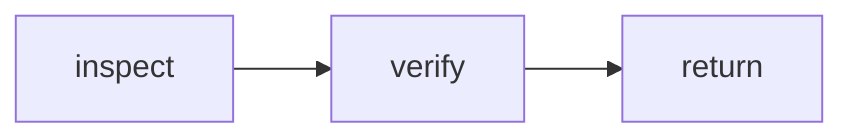

# Phenix workflow Markdown

Phenix workflows may be authored as constrained Markdown and compiled into the existing typed `WorkflowDefinition` graph.

The Markdown document is an authoring format. The compiled graph remains the sole execution model. Mermaid is explanatory and never authoritative.

## Why this format

The format keeps four concerns visibly separate:

1. Workflow identity, schemas, entry state, and resource limits.
2. A generated-or-handwritten Mermaid overview for readers.
3. Typed state declarations.
4. Authoritative transition rows.

This makes workflows reviewable without weakening runtime validation or moving control flow into natural-language prompts.

## Canonical layout

```md
# Human-readable workflow title

```phenix-workflow
id: workflow.example
description: One-line dispatch description.
input: request.objective.v1
output: outcome.base.v1
entry: inspect
timeout-ms: 600000
max-node-runs: 12
max-parallelism: 2
```

## Flow



## States

### inspect

```phenix-state
kind: invoke
run: agent.scout
input: example.inspect.input
wait: await
```

### verify

```phenix-state
kind: invoke
run: workflow.verify
input: example.verify.input
wait: await
```

### return

```phenix-state
kind: return
output: example.output
```

## Transitions

| From | To | When | Max traversals |
|---|---|---|---|
| `inspect` | `verify` | | |
| `verify` | `return` | | |
```

## State kinds

### `invoke`

Invokes any registered definition. Agent and workflow definitions use the same call boundary.

```phenix-state
kind: invoke
run: workflow.verify
input: verification.input
wait: await
```

A workflow therefore composes another workflow by invoking its public definition ID. It must not jump directly into another workflow's internal state. This preserves independent validation, limits, failure handling, and typed input/output contracts.

### `local`

Runs a deterministic local operation.

```phenix-state
kind: local
operation: local.qa-checks
input: qa.checks.input
```

### `decision`

Evaluates a registered pure decision function. Outgoing edge conditions select the transition.

```phenix-state
kind: decision
decide: implement.acceptance
```

### `join`

Joins fan-out branches using `all`, `all-success`, `first-success`, or `quorum`.

```phenix-state
kind: join
policy: all-success
```

### `return` and `fail`

Terminate with a registered output or failure mapping.

```phenix-state
kind: return
output: workflow.output
```

```phenix-state
kind: fail
reason: workflow.failure
```

## Conditions and bounded cycles

Conditions are registered pure function references, not inline JavaScript expressions.

```md
| `accepted` | `implement` | `decision.repair` | `2` |
```

Every cycle edge must declare `Max traversals`. The existing graph validator remains responsible for enforcing bounded cycles, reachability, terminal paths, definition existence, and function references.

## Prompt templates

A state may reserve an optional prompt body:

```md
#### Prompt

Verify the change for {{ input.objective }} using {{ result.implement }}.
```

The parser records this section, but the initial compiler intentionally rejects executable state prompts until template values can be attached to typed invocation input without bypassing schema validation. The intended namespace is deliberately small:

- `{{ input.* }}` — workflow input
- `{{ result.<state> }}` — validated prior state result
- `{{ runtime.* }}` — explicitly exposed runtime values
- `{{ system.* }}` — canonical generated contract or permission text

Arbitrary expressions, JavaScript, shell expansion, and permission changes are not allowed. Permissions remain properties of the invoked definition, never prose in a state prompt.

## Source examples

- `modules/phenix-pi/definitions/workflows/sources/qa.workflow.md`
- `modules/phenix-pi/definitions/workflows/sources/implement.workflow.md`
- `modules/phenix-pi/definitions/workflows/sources/qa-fix.workflow.md`

The first two compile to graphs equivalent to the current TypeScript definitions. The third demonstrates close workflow composition through public workflow invocation boundaries.
