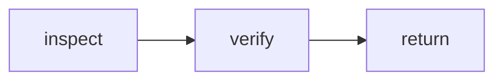

# Phenix definition Markdown

Bundled Phenix agents and workflows are authored as constrained Markdown and compiled into the existing typed `AgentDefinition` and `WorkflowDefinition` runtime objects.

Markdown is the authoring surface. Compiled definitions, schemas, graph validation, and capability enforcement remain execution authority. Mermaid is explanatory and never authoritative.

## Design rules

1. Every definition declares a stable ID and explicit input/output schema IDs.
2. Agent prompts remain static definition instructions; task data is supplied separately through the input schema.
3. Tools, context, child capabilities, and limits are structured metadata, never inferred from prose.
4. Workflow states invoke public agent or workflow definitions through typed boundaries.
5. Transition tables are authoritative; Mermaid diagrams are for readers.
6. Arbitrary expressions, JavaScript, shell expansion, and prompt-granted permissions are not supported.

## Agent format

A small agent such as the repository scout is complete in one readable file:

````md
# Repository scout

```phenix-agent
id: agent.scout
description: Answer a focused repository question with path-grounded evidence.
input: request.scout.v1
output: outcome.scout-report.v1
model: session
thinking: route
persistence: memory
```

## Tools

```phenix-tools
allow: read, grep, find, ls, phenix_present
```

## Context

```phenix-context
project-files: inherit
parent-conversation: none
artifacts:
max-bytes: 64000
```

## Children

```phenix-children
allow:
max-depth: 4
may-detach: false
may-send: false
may-cancel-children: false
```

## Limits

```phenix-limits
timeout-ms: 300000
max-repair-attempts: 1
```

## Prompt

Act as a read-only repository scout. Search narrowly, cite concrete paths and lines, distinguish evidence from inference, and do not edit files.
````

The compiler resolves both schema IDs, validates every field and enum, and produces the effective runtime definition directly. There is no secondary TypeScript policy overlay.

### Model syntax

- `session` — resolve through the owning session's model set.
- `phenix:<set>` — select a named virtual Phenix model set.
- `<provider>/<model>` — select a concrete provider model.

### Lists

Tool names, artifacts, and invokable child definitions use comma-separated values. An empty value declares an empty list.

## Workflow format

````md
# Human-readable workflow title

```phenix-workflow
id: workflow.example
description: One-line dispatch description.
input: request.objective.v1
output: outcome.base.v1
entry: inspect
timeout-ms: 600000
max-node-runs: 12
max-parallelism: 2
```

## Flow



## States

### inspect

```phenix-state
kind: invoke
run: agent.scout
input: example.inspect.input
input-schema: request.scout.v1
output-schema: outcome.scout-report.v1
wait: await
```

### verify

```phenix-state
kind: invoke
run: workflow.verify
input: example.verify.input
input-schema: request.verification.v1
output-schema: outcome.verification.v1
wait: await
```

### return

```phenix-state
kind: return
output: example.output
output-schema: outcome.base.v1
```

## Transitions

| From | To | When | Max traversals |
|---|---|---|---|
| `inspect` | `verify` | | |
| `verify` | `return` | | |
````

## State contracts

### `invoke`

An invoked state declares both the mapping used to construct the child input and the expected child schemas:

```phenix-state
kind: invoke
run: workflow.verify
input: verification.input
input-schema: request.verification.v1
output-schema: outcome.verification.v1
wait: await
```

The compiler resolves `workflow.verify` and rejects the workflow when either declared schema differs from the callee's public contract.

### `local`

A deterministic local operation also declares input and output schemas:

```phenix-state
kind: local
operation: local.qa-checks
input: qa.checks.input
input-schema: request.qa-checks.v1
output-schema: outcome.check-results.v1
```

The schemas must exist in the shared definition schema registry. Local operation implementations remain separately registered runtime authorities.

### `decision`

A decision evaluates a registered pure function. Outgoing edge conditions select the transition:

```phenix-state
kind: decision
decide: implement.acceptance
```

### `join`

A join combines fan-out branches using `all`, `all-success`, `first-success`, or `quorum`:

```phenix-state
kind: join
policy: all-success
```

### `return` and `fail`

A return state must declare the workflow's public output schema:

```phenix-state
kind: return
output: workflow.output
output-schema: outcome.base.v1
```

A fail state resolves its reason through a registered mapping:

```phenix-state
kind: fail
reason: workflow.failure
```

## Workflow composition

A workflow may invoke another workflow through the same `invoke` node used for agents:

```phenix-state
kind: invoke
run: workflow.implement
input: qa-fix.implement.input
input-schema: request.implementation.v1
output-schema: outcome.implementation-result.v1
wait: await
```

The transition targets the local state that performs the invocation. Callers cannot jump into another workflow's private internal state. This preserves independent entry points, schemas, limits, failure handling, cancellation ownership, and implementation freedom.

## Conditions and bounded cycles

Conditions are registered pure function references, not inline expressions:

```md
| `accepted` | `implement` | `decision.repair` | `2` |
```

Every cycle edge must declare `Max traversals`. The graph validator enforces bounded cycles, reachability, terminal paths, definition existence, mapping references, decision references, condition references, and parallelism limits.

## Workflow prompt templates

A state may reserve an optional prompt body:

```md
#### Prompt

Verify the change for {{ input.objective }} using {{ result.implement }}.
```

The parser records this section, but compilation currently rejects it. Template execution will only be enabled once replacements can be attached to schema-validated invocation input without bypassing capability enforcement. The intended namespaces are limited to `input.*`, `result.*`, explicitly exposed `runtime.*`, and generated `system.*` values.

## Source layout

- `modules/phenix-pi/definitions/agents/sources/*.agent.md`
- `modules/phenix-pi/definitions/workflows/sources/*.workflow.md`
- `modules/phenix-pi/definitions/schema-registry.ts`
- `modules/phenix-pi/adapters/agent/markdown.ts`
- `modules/phenix-pi/adapters/workflow/markdown.ts`

The bundled agent and workflow registries load these Markdown files directly. Tests verify that every source compiles, all catalog definitions validate, step contracts match referenced definitions, and nested workflow execution preserves typed outcomes.
