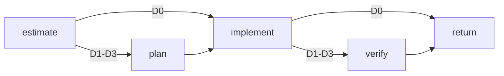

# Phenix definition Markdown

Bundled agents and workflows are authored as constrained Markdown. IDs and schema references must be stable, prompts must remain static, and Mermaid diagrams are descriptive only.

## Agent definitions

````md
# Repository scout

```phenix-agent
id: agent.scout
description: Answer a focused repository question with path-grounded evidence.
input: request.scout.v1
output: outcome.scout-report.v1
model: session
thinking: route
persistence: memory
```

## Models

| Difficulty | Model | Capability | Thinking |
|---|---|---|---|
| `D0` | `session` | `fast` | `minimal` |
| `D1` | `session` | `general` | `low` |
| `D2` | `session` | `reasoning` | `medium` |
| `D3` | `session` | `reasoning` | `high` |

## Tools

```phenix-tools
allow: read, grep, find, ls, phenix_present
```

## Context

```phenix-context
project-files: inherit
parent-conversation: none
artifacts:
max-bytes: 64000
```

## Children

```phenix-children
allow:
max-depth: 4
may-detach: false
may-send: false
may-cancel-children: false
```

## Limits

```phenix-limits
timeout-ms: 300000
max-repair-attempts: 1
```

## Prompt

Act as a read-only repository scout. Search narrowly, cite concrete paths and lines, distinguish evidence from inference, and do not edit files.
````

### Model selectors

- `session`: use the owning session's selected model set.
- `phenix:<set>`: use a named Phenix model set.
- `<provider>/<model>`: use one concrete provider model.

`## Models` is optional. When present, it must contain one row for each difficulty from `D0` through `D3`. Tool names, artifacts, and child definition IDs use comma-separated lists; an empty value means an empty list.

### Prompt mode

`prompt-mode` may be:

- `replace`: use the definition prompt and Phenix execution instructions;
- `append-default`: retain Pi's built-in coding prompt and append the definition prompt.

Omitted means `replace`. `session.stock` uses Pi's ordinary prompt and does not use this field.

## Workflow definitions

````md
# Difficulty-aware implementation

```phenix-workflow
id: workflow.example
input: request.implementation.v1
output: outcome.implementation-result.v1
entry: estimate
timeout-ms: 600000
max-node-runs: 12
max-parallelism: 1
```

## Flow



## States

### estimate

```phenix-state
kind: invoke
run: agent.difficulty-estimator
input: difficulty.input
input-schema: request.difficulty-assessment.v1
output-schema: outcome.difficulty-assessment.v1
wait: await
difficulty: D0
retry: retryable
max-retries: 1
```

### plan

```phenix-state
kind: invoke
run: agent.planner
input: example.plan.input
input-schema: request.plan.v1
output-schema: outcome.plan.v1
wait: await
difficulty: result:estimate
```

### implement

```phenix-state
kind: invoke
run: agent.implementer
input: example.implement.input
input-schema: request.implementation.v1
output-schema: outcome.change-set.v1
wait: await
difficulty: result:estimate
```

### verify

```phenix-state
kind: invoke
run: agent.verifier
input: example.verify.input
input-schema: request.verification.v1
output-schema: outcome.verification.v1
wait: await
difficulty: result:estimate
retry: retryable
max-retries: 1
```

### return

```phenix-state
kind: return
output: example.output
output-schema: outcome.implementation-result.v1
```

## Transitions

| From | To | On | When | Max traversals |
|---|---|---|---|---|
| `estimate` | `implement` | `success` | `difficulty.D0` | |
| `estimate` | `plan` | `success` | `difficulty.at-least-D1` | |
| `plan` | `implement` | `success` | | |
| `implement` | `return` | `success` | `difficulty.D0` | |
| `implement` | `verify` | `success` | `difficulty.at-least-D1` | |
| `verify` | `return` | `success` | | |
````

The transition table controls execution. `On` accepts `success`, `failure`, `cancelled`, or `any`; omitted means `success`. Every cycle edge must set `Max traversals`.

## State kinds

### `invoke`

Runs an agent, workflow, or `session.stock`. It declares an input mapping, input schema, output schema, waiting policy, optional difficulty, and optional retry settings.

Difficulty may be:

- omitted: inherit the current workflow difficulty;
- `D0` through `D3`: use a fixed difficulty;
- `result:<state>`: use the validated `difficulty` field from an earlier successful state.

`retry: retryable` permits replacement only when the child failure is marked retryable. `max-retries` counts replacement attempts after the first run. Background invocations cannot use automatic retry.

### `local`

Runs a registered deterministic operation:

```phenix-state
kind: local
operation: local.qa-checks
input: qa.checks.input
input-schema: request.qa-checks.v1
output-schema: outcome.check-results.v1
```

### `decision`

Evaluates a registered pure decision function:

```phenix-state
kind: decision
decide: implement.acceptance
```

### `join`

Combines fan-out branches using `all`, `all-success`, `first-success`, or `quorum`.

### `return` and `fail`

`return` produces the workflow result through a registered mapping. `fail` produces a typed failure through a registered mapping.

A workflow may invoke another workflow with an ordinary `invoke` state. The caller enters through the nested workflow's public input and receives its public result.

## Tests

Workflow files may include `## Tests` scenarios. See `docs/WORKFLOW_TESTS.md`.

## Source files

- `modules/phenix-pi/definitions/agents/sources/*.agent.md`
- `modules/phenix-pi/definitions/workflows/sources/*.workflow.md`
- `modules/phenix-pi/definitions/schema-registry.ts`
