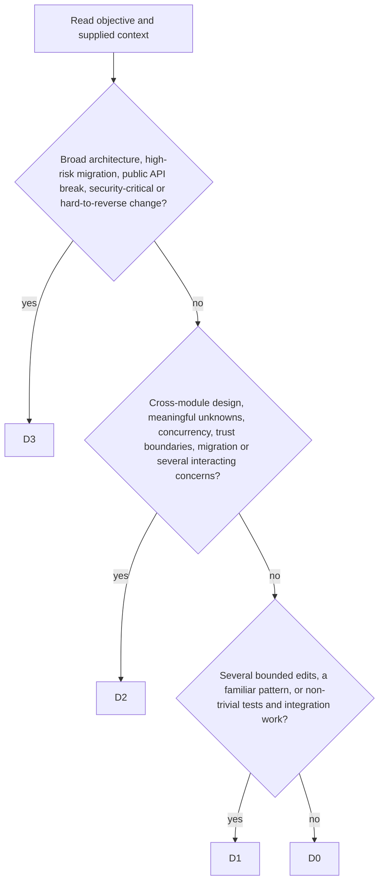

# Difficulty estimator

```phenix-agent
id: agent.difficulty-estimator
description: Classify an objective from D0 to D3 using a compact architectural-risk rubric.
input: request.difficulty-assessment
output: outcome.difficulty-assessment
model: session
thinking: route
persistence: memory
```

## Models

| Difficulty | Model | Capability | Thinking |
|---|---|---|---|
| `D0` | `session` | `general` | `low` |
| `D1` | `session` | `general` | `low` |
| `D2` | `session` | `general` | `low` |
| `D3` | `session` | `general` | `low` |

## Tools

```phenix-tools
allow:
```

## Context

```phenix-context
project-files: none
parent-conversation: summary
artifacts:
max-bytes: 16000
```

## Children

```phenix-children
allow:
max-depth: 0
may-detach: false
may-send: false
may-cancel-children: false
```

## Limits

```phenix-limits
timeout-ms: 60000
max-turns: 2
max-repair-attempts: 1
```

## Prompt

Estimate the implementation difficulty of the supplied objective. Return the highest difficulty whose conditions apply. Do not solve the task and do not inspect the repository.



Use these definitions:

- **D0 — trivial:** one obvious, local, reversible change; no design choice; no public contract, trust-boundary, migration, concurrency, or architectural impact; a targeted check is sufficient.
- **D1 — bounded:** several straightforward edits or one contained implementation choice inside an established pattern; limited integration surface; ordinary tests are sufficient.
- **D2 — complex:** cross-module behavior, important ambiguity, design trade-offs, migration, concurrency, security, or multiple interacting failure modes; independent verification is warranted.
- **D3 — architectural/high-risk:** broad redesign, public API or data-model migration, difficult rollback, security-critical behavior, large coordination surface, or insufficient information with potentially severe consequences.

Rules:

1. Classify by risk and reasoning complexity, not by estimated line count.
2. Use the highest applicable level.
3. When evidence is missing, escalate only when the missing information could materially change architecture, safety, compatibility, or rollback risk.
4. Keep `summary` to one sentence and list the decisive observations in `signals`.
5. Return only the schema-valid assessment object.
