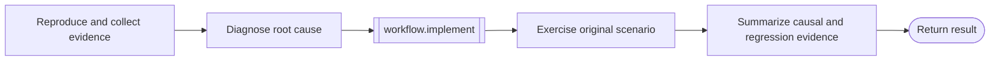

# Debug workflow

```phenix-workflow
id: workflow.debug
description: Reproduce an uncertain failure, diagnose its root cause, apply a bounded repair, rerun the original scenario, and synthesize the evidence.
input: request.objective
output: outcome.base
entry: reproduce
timeout-ms: 4800000
max-node-runs: 12
max-parallelism: 1
```

## Flow



## States

### reproduce

```phenix-state
kind: invoke
title: Reproduce the reported behavior
run: agent.reproducer
input: debug.reproduce.input
input-schema: request.scout
output-schema: outcome.scout-report
wait: await
difficulty: D2
retry: retryable
max-retries: 1
```

### diagnose

```phenix-state
kind: invoke
title: Establish a causal diagnosis
run: agent.critic
input: debug.diagnose.input
input-schema: request.critic
output-schema: outcome.critic-report
wait: await
difficulty: D3
retry: retryable
max-retries: 1
```

### implement

```phenix-state
kind: invoke
title: Apply the root-cause repair
run: workflow.implement
input: debug.implement.input
input-schema: request.implementation
output-schema: outcome.implementation-result
wait: await
```

### regression

```phenix-state
kind: invoke
title: Verify the original scenario and relevant regressions
run: agent.tester
input: debug.regression.input
input-schema: request.test
output-schema: outcome.test-report
wait: await
difficulty: D2
retry: retryable
max-retries: 1
```

### finalize

```phenix-state
kind: invoke
title: Produce the debug handoff
run: agent.finalizer
input: debug.finalize.input
input-schema: request.objective
output-schema: outcome.base
wait: await
difficulty: D2
retry: retryable
max-retries: 1
```

### return

```phenix-state
kind: return
output: debug.output
output-schema: outcome.base
```

## Transitions

| From | To | When | Max traversals |
|---|---|---|---|
| `reproduce` | `diagnose` | | |
| `diagnose` | `implement` | | |
| `implement` | `regression` | | |
| `regression` | `finalize` | | |
| `finalize` | `return` | | |

## Tests

### repaired-regression

```phenix-test
{
  "input": { "objective": "Fix an intermittent parser regression" },
  "mocks": {
    "reproduce": [{ "return": { "summary": "Reproduced", "evidence": [{ "path": "src/parser.ts", "finding": "targeted command fails" }], "risks": [] } }],
    "diagnose": [{ "return": { "summary": "Root cause identified", "findings": [{ "severity": "high", "title": "stale state", "evidence": "state survives reset" }] } }],
    "estimate": [{ "return": { "difficulty": "D0", "summary": "Targeted repair", "signals": ["single bounded edit"] } }],
    "implement": [{ "return": { "summary": "Reset parser state", "changedFiles": ["src/parser.ts"], "checks": [{ "command": "devenv test", "ok": true, "summary": "passed" }], "unresolved": [] } }],
    "trivial-accept": [{ "return": { "accepted": true, "summary": "Targeted checks passed", "findings": [], "evidence": ["devenv test passed"] } }],
    "regression": [{ "return": { "summary": "Regression eliminated", "checks": [{ "command": "devenv test", "ok": true, "summary": "passed" }], "findings": [], "evidence": ["original scenario passes"] } }],
    "finalize": [{ "return": { "summary": "Debug complete", "artifacts": [], "unresolved": [] } }]
  },
  "expect": { "status": "success" }
}
```
