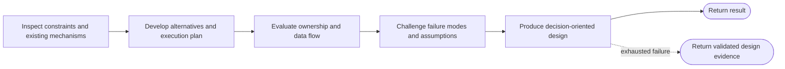

# Design workflow

```phenix-workflow
id: workflow.design
description: Inspect the existing system, develop an executable design, challenge its boundaries and failure modes, and return a decision-oriented handoff without mutation.
input: request.objective
output: outcome.base
entry: inspect
max-node-runs: 12
max-parallelism: 1
```

## Flow



## States

### inspect

```phenix-state
kind: invoke
title: Inspect requirements, constraints, and reusable mechanisms
run: agent.scout
input: design.inspect.input
input-schema: request.scout
output-schema: outcome.scout-report
wait: await
difficulty: D2
retry: retryable
max-retries: 1
```

### alternatives

```phenix-state
kind: invoke
title: Develop alternatives and an executable plan
run: agent.planner
input: design.alternatives.input
input-schema: request.plan
output-schema: outcome.plan
wait: await
difficulty: D3
retry: retryable
max-retries: 1
```

### architecture

```phenix-state
kind: invoke
title: Evaluate ownership, interfaces, and data flow
run: agent.architect
input: design.architecture.input
input-schema: request.critic
output-schema: outcome.critic-report
wait: await
difficulty: D3
retry: retryable
max-retries: 1
```

### critique

```phenix-state
kind: invoke
title: Challenge assumptions and failure modes
run: agent.critic
input: design.critique.input
input-schema: request.critic
output-schema: outcome.critic-report
wait: await
difficulty: D3
retry: retryable
max-retries: 1
```

### finalize

```phenix-state
kind: invoke
title: Produce the design handoff
run: agent.finalizer
input: design.finalize.input
input-schema: request.objective
output-schema: outcome.base
wait: await
difficulty: D3
retry: retryable
max-retries: 1
```

### fallback

```phenix-state
kind: return
output: design.fallback
output-schema: outcome.base
```

### return

```phenix-state
kind: return
output: design.output
output-schema: outcome.base
```

## Transitions

| From | To | On | When | Max traversals |
|---|---|---|---|---|
| `inspect` | `alternatives` | | | |
| `alternatives` | `architecture` | | | |
| `architecture` | `critique` | | | |
| `critique` | `finalize` | | | |
| `finalize` | `return` | | | |
| `finalize` | `fallback` | `failure` | | |

## Tests

### decision-handoff

```phenix-test
{
  "input": { "objective": "Design a host-neutral rendering boundary" },
  "mocks": {
    "inspect": [{ "return": { "summary": "Existing boundaries inspected", "evidence": [{ "path": "src/ui.ts", "finding": "host dependency crosses frontend boundary" }], "risks": [] } }],
    "alternatives": [{ "return": { "summary": "Compared two designs", "steps": ["extract semantic surface", "adapt host rendering"], "constraints": ["preserve native transcript"], "checks": ["boundary tests"] } }],
    "architecture": [{ "return": { "summary": "Ownership defined", "findings": [] } }],
    "critique": [{ "return": { "summary": "Risks challenged", "findings": [] } }],
    "finalize": [{ "return": { "summary": "Design selected", "artifacts": [], "unresolved": [] } }]
  },
  "expect": { "status": "success", "counts": { "inspect": 1, "alternatives": 1, "architecture": 1, "critique": 1, "finalize": 1, "return": 1 } }
}
```

### finalizer-failure-preserves-design

```phenix-test
{
  "input": { "objective": "Design a resilient integration" },
  "mocks": {
    "inspect": [{ "return": { "summary": "Constraints inspected", "evidence": [], "risks": [] } }],
    "alternatives": [{ "return": { "summary": "Alternatives compared", "steps": ["compose services"], "constraints": [], "checks": ["boundary tests"] } }],
    "architecture": [{ "return": { "summary": "Ownership established", "findings": [] } }],
    "critique": [{ "return": { "summary": "Failure modes challenged", "findings": [] } }],
    "finalize": [
      { "fail": { "code": "provider_failed", "message": "provider unavailable", "retryable": true } },
      { "fail": { "code": "provider_failed", "message": "provider still unavailable", "retryable": true } }
    ]
  },
  "expect": {
    "status": "success",
    "visits": ["inspect", "alternatives", "architecture", "critique", "finalize", "fallback"],
    "transitions": ["inspect->alternatives", "alternatives->architecture", "architecture->critique", "critique->finalize", "finalize->fallback"],
    "requireAllMocksConsumed": true
  }
}
```
