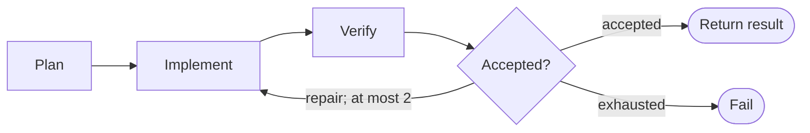

# Implementation workflow

```phenix-workflow
id: workflow.implement
description: Plan, implement, independently verify, and perform at most two repair attempts.
input: request.implementation.v1
output: outcome.implementation-result.v1
entry: plan
timeout-ms: 2400000
max-node-runs: 20
max-parallelism: 1
```

## Flow



## States

### plan

```phenix-state
kind: invoke
title: Produce an executable plan
run: agent.planner
input: implement.plan.input
wait: await
```

### implement

```phenix-state
kind: invoke
title: Apply the current implementation attempt
run: agent.implementer
input: implement.work.input
wait: await
```

### verify

```phenix-state
kind: invoke
title: Independently verify the attempt
run: agent.verifier
input: implement.verify.input
wait: await
```

### accepted

```phenix-state
kind: decision
decide: implement.acceptance
```

### return

```phenix-state
kind: return
output: implement.output
```

### fail

```phenix-state
kind: fail
reason: implement.failure
```

## Transitions

| From | To | When | Max traversals |
|---|---|---|---|
| `plan` | `implement` | | |
| `implement` | `verify` | | `3` |
| `verify` | `accepted` | | `3` |
| `accepted` | `return` | `decision.accepted` | |
| `accepted` | `implement` | `decision.repair` | `2` |
| `accepted` | `fail` | `decision.exhausted` | |
