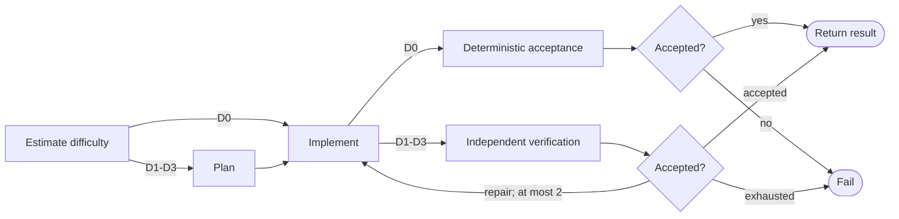

# Implementation workflow

```phenix-workflow
id: workflow.implement
description: Estimate difficulty, use a trivial fast path when safe, otherwise plan, implement, independently verify, and perform bounded repairs.
input: request.implementation.v1
output: outcome.implementation-result.v1
entry: estimate
timeout-ms: 2400000
max-node-runs: 24
max-parallelism: 1
```

## Flow



## States

### estimate

```phenix-state
kind: invoke
title: Estimate task difficulty
run: agent.difficulty-estimator
input: difficulty.input
input-schema: request.difficulty-assessment.v1
output-schema: outcome.difficulty-assessment.v1
wait: await
difficulty: D0
```

### plan

```phenix-state
kind: invoke
title: Produce an executable plan
run: agent.planner
input: implement.plan.input
input-schema: request.plan.v1
output-schema: outcome.plan.v1
wait: await
difficulty: result:estimate
```

### implement

```phenix-state
kind: invoke
title: Apply the current implementation attempt
run: agent.implementer
input: implement.work.input
input-schema: request.implementation.v1
output-schema: outcome.change-set.v1
wait: await
difficulty: result:estimate
```

### trivial-accept

```phenix-state
kind: local
title: Accept a trivial change only from deterministic evidence
operation: local.noop
input: implement.trivial-verification
input-schema: outcome.verification.v1
output-schema: outcome.verification.v1
```

### trivial-decision

```phenix-state
kind: decision
decide: implement.trivial-acceptance
```

### verify

```phenix-state
kind: invoke
title: Independently verify the attempt
run: agent.verifier
input: implement.verify.input
input-schema: request.verification.v1
output-schema: outcome.verification.v1
wait: await
difficulty: result:estimate
```

### accepted

```phenix-state
kind: decision
decide: implement.acceptance
```

### return

```phenix-state
kind: return
output: implement.output
output-schema: outcome.implementation-result.v1
```

### fail

```phenix-state
kind: fail
reason: implement.failure
```

## Transitions

| From | To | When | Max traversals |
|---|---|---|---|
| `estimate` | `implement` | `difficulty.D0` | |
| `estimate` | `plan` | `difficulty.at-least-D1` | |
| `plan` | `implement` | | |
| `implement` | `trivial-accept` | `difficulty.D0` | |
| `trivial-accept` | `trivial-decision` | | |
| `trivial-decision` | `return` | `decision.accepted` | |
| `trivial-decision` | `fail` | `decision.exhausted` | |
| `implement` | `verify` | `difficulty.at-least-D1` | `3` |
| `verify` | `accepted` | | `3` |
| `accepted` | `return` | `decision.accepted` | |
| `accepted` | `implement` | `decision.repair` | `2` |
| `accepted` | `fail` | `decision.exhausted` | |
