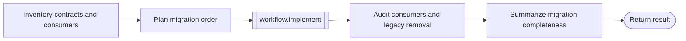

# Migration workflow

```phenix-workflow
id: workflow.migrate
description: Inventory providers and consumers, plan dependency order, execute the migration, and audit removal of obsolete paths.
input: request.objective
output: outcome.base
entry: inventory
timeout-ms: 7200000
max-node-runs: 14
max-parallelism: 1
```

## Flow



## States

### inventory

```phenix-state
kind: invoke
title: Inventory affected contracts, providers, and consumers
run: agent.scout
input: migrate.inventory.input
input-schema: request.scout
output-schema: outcome.scout-report
wait: await
difficulty: D3
retry: retryable
max-retries: 1
```

### plan

```phenix-state
kind: invoke
title: Produce an ordered migration plan
run: agent.planner
input: migrate.plan.input
input-schema: request.plan
output-schema: outcome.plan
wait: await
difficulty: D3
retry: retryable
max-retries: 1
```

### implement

```phenix-state
kind: invoke
title: Execute the migration and cleanup
run: workflow.implement
input: migrate.implement.input
input-schema: request.implementation
output-schema: outcome.implementation-result
wait: await
```

### audit

```phenix-state
kind: invoke
title: Audit migrated consumers and obsolete interfaces
run: agent.critic
input: migrate.audit.input
input-schema: request.critic
output-schema: outcome.critic-report
wait: await
difficulty: D3
retry: retryable
max-retries: 1
```

### finalize

```phenix-state
kind: invoke
title: Produce the migration handoff
run: agent.finalizer
input: migrate.finalize.input
input-schema: request.objective
output-schema: outcome.base
wait: await
difficulty: D2
retry: retryable
max-retries: 1
```

### return

```phenix-state
kind: return
output: migrate.output
output-schema: outcome.base
```

## Transitions

| From | To | When | Max traversals |
|---|---|---|---|
| `inventory` | `plan` | | |
| `plan` | `implement` | | |
| `implement` | `audit` | | |
| `audit` | `finalize` | | |
| `finalize` | `return` | | |

## Tests

### provider-consumer-migration

```phenix-test
{
  "input": { "objective": "Migrate a public contract and all consumers" },
  "mocks": {
    "inventory": [{ "return": { "summary": "Provider and consumers inventoried", "evidence": [{ "path": "src/provider.ts", "finding": "two consumers depend on the old contract" }], "risks": ["stale generated consumer"] } }],
    "plan": [{ "return": { "summary": "Provider-first migration", "steps": ["change provider", "migrate consumers", "remove old contract"], "constraints": ["no compatibility fallback"], "checks": ["devenv test"] } }],
    "estimate": [{ "return": { "difficulty": "D0", "summary": "Bounded migration slice", "signals": ["known provider and consumers"] } }],
    "implement": [{ "return": { "summary": "Migrated provider and consumers", "changedFiles": ["src/provider.ts", "src/consumer.ts"], "checks": [{ "command": "devenv test", "ok": true, "summary": "passed" }], "unresolved": [] } }],
    "trivial-accept": [{ "return": { "accepted": true, "summary": "Migration checks passed", "findings": [], "evidence": ["devenv test passed"] } }],
    "audit": [{ "return": { "summary": "No stale consumers remain", "findings": [] } }],
    "finalize": [{ "return": { "summary": "Migration complete", "artifacts": [], "unresolved": [] } }]
  },
  "expect": { "status": "success" }
}
```
