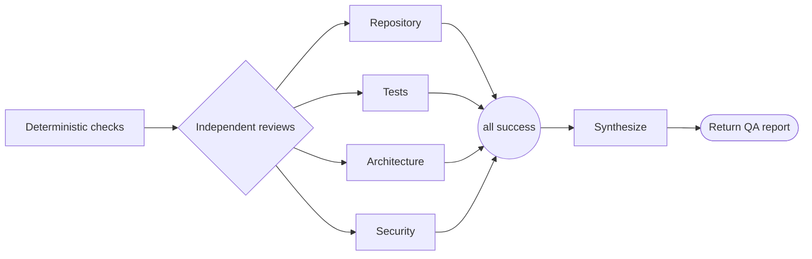

# QA workflow

```phenix-workflow
id: workflow.qa
description: Run deterministic project checks and independent repository, architecture, test, and security reviews, then synthesize with deliberately capable review routes.
input: request.objective.v1
output: outcome.qa-report.v1
entry: checks
timeout-ms: 2400000
max-node-runs: 20
max-parallelism: 4
```

## Flow



## States

### checks

```phenix-state
kind: local
title: Run deterministic repository checks
operation: local.qa-checks
input: qa.checks.input
input-schema: request.qa-checks.v1
output-schema: outcome.check-results.v1
```

### fanout

```phenix-state
kind: local
title: Start independent QA branches
operation: local.noop
input: input.identity
input-schema: request.objective.v1
output-schema: request.objective.v1
```

### repo

```phenix-state
kind: invoke
title: Review repository structure and correctness
run: agent.scout
input: qa.repo.input
input-schema: request.scout.v1
output-schema: outcome.scout-report.v1
wait: await
difficulty: D2
retry: retryable
max-retries: 1
```

### tests

```phenix-state
kind: invoke
title: Interpret deterministic checks and coverage gaps
run: agent.tester
input: qa.tests.input
input-schema: request.test.v1
output-schema: outcome.test-report.v1
wait: await
difficulty: D2
retry: retryable
max-retries: 1
```

### architecture

```phenix-state
kind: invoke
title: Review architecture and module boundaries
run: agent.architect
input: qa.arch.input
input-schema: request.critic.v1
output-schema: outcome.critic-report.v1
wait: await
difficulty: D3
retry: retryable
max-retries: 1
```

### security

```phenix-state
kind: invoke
title: Review security and trust boundaries
run: agent.critic
input: qa.security.input
input-schema: request.critic.v1
output-schema: outcome.critic-report.v1
wait: await
difficulty: D3
retry: retryable
max-retries: 1
```

### join

```phenix-state
kind: join
policy: all-success
```

### synthesize

```phenix-state
kind: invoke
run: agent.qa-synthesizer
input: qa.synthesize.input
input-schema: request.qa-synthesis.v1
output-schema: outcome.qa-report.v1
wait: await
difficulty: D3
retry: retryable
max-retries: 1
```

### return

```phenix-state
kind: return
output: qa.output
output-schema: outcome.qa-report.v1
```

## Transitions

| From | To | When | Max traversals |
|---|---|---|---|
| `checks` | `fanout` | | |
| `fanout` | `repo` | | |
| `fanout` | `tests` | | |
| `fanout` | `architecture` | | |
| `fanout` | `security` | | |
| `repo` | `join` | | |
| `tests` | `join` | | |
| `architecture` | `join` | | |
| `security` | `join` | | |
| `join` | `synthesize` | | |
| `synthesize` | `return` | | |

## Tests

### all-branches-succeed

```phenix-test
{
  "input": { "objective": "Run a full repository QA review" },
  "mocks": {
    "checks": [{ "return": [{ "command": "devenv test", "ok": true, "summary": "passed" }] }],
    "fanout": [{ "return": { "objective": "Run a full repository QA review" } }],
    "repo": [{ "return": { "summary": "Repository review passed", "evidence": [], "risks": [] } }],
    "tests": [{ "return": { "summary": "Checks passed", "checks": [], "findings": [], "evidence": [] } }],
    "architecture": [{ "return": { "summary": "Architecture review passed", "findings": [] } }],
    "security": [{ "return": { "summary": "Security review passed", "findings": [] } }],
    "synthesize": [{
      "return": {
        "summary": "QA passed",
        "checks": [{ "command": "devenv test", "ok": true, "summary": "passed" }],
        "findings": [],
        "reports": []
      }
    }]
  },
  "expect": {
    "status": "success",
    "counts": {
      "checks": 1,
      "fanout": 1,
      "repo": 1,
      "tests": 1,
      "architecture": 1,
      "security": 1,
      "join": 1,
      "synthesize": 1,
      "return": 1
    }
  }
}
```

### security-retries-in-place

```phenix-test
{
  "input": { "objective": "Run QA while recovering one transient security timeout" },
  "mocks": {
    "checks": [{ "return": [{ "command": "devenv test", "ok": true, "summary": "passed" }] }],
    "fanout": [{ "return": { "objective": "Run QA while recovering one transient security timeout" } }],
    "repo": [{ "return": { "summary": "Repository review passed", "evidence": [], "risks": [] } }],
    "tests": [{ "return": { "summary": "Checks passed", "checks": [], "findings": [], "evidence": [] } }],
    "architecture": [{ "return": { "summary": "Architecture review passed", "findings": [] } }],
    "security": [
      {
        "fail": {
          "code": "timeout",
          "message": "Agent timed out after 480000ms",
          "retryable": true,
          "details": {
            "source": "automatic",
            "category": "resource_limit",
            "suggestedLimits": { "timeoutMs": 960000 }
          }
        }
      },
      { "return": { "summary": "Security review passed after retry", "findings": [] } }
    ],
    "synthesize": [{
      "return": {
        "summary": "QA passed after bounded recovery",
        "checks": [{ "command": "devenv test", "ok": true, "summary": "passed" }],
        "findings": [],
        "reports": []
      }
    }]
  },
  "expect": {
    "status": "success",
    "visits": ["checks", "fanout", "repo", "tests", "architecture", "security", "join", "synthesize", "return"],
    "counts": {
      "checks": 1,
      "fanout": 1,
      "repo": 1,
      "tests": 1,
      "architecture": 1,
      "security": 1,
      "join": 1,
      "synthesize": 1,
      "return": 1
    },
    "requireAllMocksConsumed": true
  }
}
```
