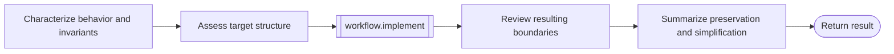

# Refactor workflow

```phenix-workflow
id: workflow.refactor
description: Capture behavioral invariants, assess the target architecture, perform a behavior-preserving refactor, and review the resulting structure.
input: request.objective
output: outcome.base
entry: characterize
timeout-ms: 4800000
max-node-runs: 12
max-parallelism: 1
```

## Flow



## States

### characterize

```phenix-state
kind: invoke
title: Capture public behavior and invariants
run: agent.scout
input: refactor.characterize.input
input-schema: request.scout
output-schema: outcome.scout-report
wait: await
difficulty: D2
retry: retryable
max-retries: 1
```

### architecture

```phenix-state
kind: invoke
title: Define the intended ownership and dependency structure
run: agent.architect
input: refactor.architecture.input
input-schema: request.critic
output-schema: outcome.critic-report
wait: await
difficulty: D3
retry: retryable
max-retries: 1
```

### implement

```phenix-state
kind: invoke
title: Apply the behavior-preserving refactor
run: workflow.implement
input: refactor.implement.input
input-schema: request.implementation
output-schema: outcome.implementation-result
wait: await
```

### review

```phenix-state
kind: invoke
title: Review the resulting architecture and semantic preservation
run: agent.architect
input: refactor.review.input
input-schema: request.critic
output-schema: outcome.critic-report
wait: await
difficulty: D3
retry: retryable
max-retries: 1
```

### finalize

```phenix-state
kind: invoke
title: Produce the refactor handoff
run: agent.finalizer
input: refactor.finalize.input
input-schema: request.objective
output-schema: outcome.base
wait: await
difficulty: D2
retry: retryable
max-retries: 1
```

### return

```phenix-state
kind: return
output: refactor.output
output-schema: outcome.base
```

## Transitions

| From | To | When | Max traversals |
|---|---|---|---|
| `characterize` | `architecture` | | |
| `architecture` | `implement` | | |
| `implement` | `review` | | |
| `review` | `finalize` | | |
| `finalize` | `return` | | |

## Tests

### preserve-behavior

```phenix-test
{
  "input": { "objective": "Simplify module boundaries without changing behavior" },
  "mocks": {
    "characterize": [{ "return": { "summary": "Behavior characterized", "evidence": [{ "path": "src/api.ts", "finding": "public behavior covered by tests" }], "risks": [] } }],
    "architecture": [{ "return": { "summary": "Simpler ownership proposed", "findings": [{ "severity": "medium", "title": "duplicate boundary", "evidence": "two modules own the same state" }] } }],
    "estimate": [{ "return": { "difficulty": "D0", "summary": "Bounded structural change", "signals": ["characterized behavior"] } }],
    "implement": [{ "return": { "summary": "Consolidated state ownership", "changedFiles": ["src/api.ts", "src/state.ts"], "checks": [{ "command": "devenv test", "ok": true, "summary": "passed" }], "unresolved": [] } }],
    "trivial-accept": [{ "return": { "accepted": true, "summary": "Characterization checks passed", "findings": [], "evidence": ["devenv test passed"] } }],
    "review": [{ "return": { "summary": "Architecture is simpler", "findings": [] } }],
    "finalize": [{ "return": { "summary": "Refactor complete", "artifacts": [], "unresolved": [] } }]
  },
  "expect": { "status": "success" }
}
```
