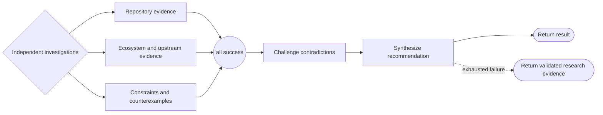

# Research workflow

```phenix-workflow
id: workflow.research
description: Investigate repository evidence, ecosystem evidence, and constraints in parallel, challenge contradictions, and synthesize a source-oriented recommendation without mutation.
input: request.objective
output: outcome.base
entry: fanout
max-node-runs: 12
max-parallelism: 3
```

## Flow



## States

### fanout

```phenix-state
kind: local
title: Start independent research branches
operation: local.noop
input: input.identity
input-schema: request.objective
output-schema: request.objective
```

### repository

```phenix-state
kind: invoke
title: Investigate repository and implementation evidence
run: agent.researcher
input: research.repository.input
input-schema: request.scout
output-schema: outcome.scout-report
wait: await
difficulty: D2
retry: retryable
max-retries: 1
```

### ecosystem

```phenix-state
kind: invoke
title: Investigate upstream, documentation, and prior-art evidence
run: agent.researcher
input: research.ecosystem.input
input-schema: request.scout
output-schema: outcome.scout-report
wait: await
difficulty: D2
retry: retryable
max-retries: 1
```

### constraints

```phenix-state
kind: invoke
title: Investigate constraints, risks, and counterexamples
run: agent.researcher
input: research.constraints.input
input-schema: request.scout
output-schema: outcome.scout-report
wait: await
difficulty: D2
retry: retryable
max-retries: 1
```

### join

```phenix-state
kind: join
policy: all-success
```

### challenge

```phenix-state
kind: invoke
title: Challenge contradictions and unsupported conclusions
run: agent.critic
input: research.challenge.input
input-schema: request.critic
output-schema: outcome.critic-report
wait: await
difficulty: D3
retry: retryable
max-retries: 1
```

### finalize

```phenix-state
kind: invoke
title: Produce the research handoff
run: agent.finalizer
input: research.finalize.input
input-schema: request.objective
output-schema: outcome.base
wait: await
difficulty: D3
retry: retryable
max-retries: 1
```

### fallback

```phenix-state
kind: return
output: research.fallback
output-schema: outcome.base
```

### return

```phenix-state
kind: return
output: research.output
output-schema: outcome.base
```

## Transitions

| From | To | On | When | Max traversals |
|---|---|---|---|---|
| `fanout` | `repository` | | | |
| `fanout` | `ecosystem` | | | |
| `fanout` | `constraints` | | | |
| `repository` | `join` | | | |
| `ecosystem` | `join` | | | |
| `constraints` | `join` | | | |
| `join` | `challenge` | | | |
| `challenge` | `finalize` | | | |
| `finalize` | `return` | | | |
| `finalize` | `fallback` | `failure` | | |

## Tests

### evidence-synthesis

```phenix-test
{
  "input": { "objective": "Evaluate whether an integration is feasible" },
  "mocks": {
    "fanout": [{ "return": { "objective": "Evaluate whether an integration is feasible" } }],
    "repository": [{ "return": { "summary": "Local implementation inspected", "evidence": [{ "path": "src/integration.ts", "finding": "existing seam is reusable" }], "risks": [] } }],
    "ecosystem": [{ "return": { "summary": "Upstream capability confirmed", "evidence": [{ "path": "docs/upstream.md", "finding": "required event API exists" }], "risks": [] } }],
    "constraints": [{ "return": { "summary": "Operational limits identified", "evidence": [{ "path": "src/runtime.ts", "finding": "boundary crossings should remain bounded" }], "risks": ["additional serialization cost"] } }],
    "challenge": [{ "return": { "summary": "Evidence reconciled", "findings": [] } }],
    "finalize": [{ "return": { "summary": "Integration is feasible with bounded crossings", "artifacts": [], "unresolved": [] } }]
  },
  "expect": { "status": "success", "counts": { "fanout": 1, "repository": 1, "ecosystem": 1, "constraints": 1, "join": 1, "challenge": 1, "finalize": 1, "return": 1 } }
}
```
