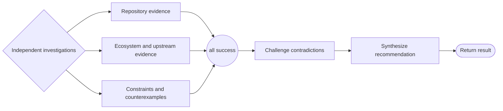

# Research workflow

```phenix-workflow
id: workflow.research
description: Investigate repository evidence, ecosystem evidence, and constraints in parallel, challenge contradictions, and synthesize a source-oriented recommendation without mutation.
input: request.objective
output: outcome.base
entry: fanout
timeout-ms: 3600000
max-node-runs: 12
max-parallelism: 3
```

## Flow



## States

### fanout

```phenix-state
kind: local
title: Start independent research branches
operation: local.noop
input: input.identity
input-schema: request.objective
output-schema: request.objective
```

### repository

```phenix-state
kind: invoke
title: Investigate repository and implementation evidence
run: agent.scout
input: research.repository.input
input-schema: request.scout
output-schema: outcome.scout-report
wait: await
difficulty: D2
retry: retryable
max-retries: 1
```

### ecosystem

```phenix-state
kind: invoke
title: Investigate upstream, documentation, and prior-art evidence
run: agent.scout
input: research.ecosystem.input
input-schema: request.scout
output-schema: outcome.scout-report
wait: await
difficulty: D2
retry: retryable
max-retries: 1
```

### constraints

```phenix-state
kind: invoke
title: Investigate constraints, risks, and counterexamples
run: agent.scout
input: research.constraints.input
input-schema: request.scout
output-schema: outcome.scout-report
wait: await
difficulty: D2
retry: retryable
max-retries: 1
```

### join

```phenix-state
kind: join
policy: all-success
```

### challenge

```phenix-state
kind: invoke
title: Challenge contradictions and unsupported conclusions
run: agent.critic
input: research.challenge.input
input-schema: request.critic
output-schema: outcome.critic-report
wait: await
difficulty: D3
retry: retryable
max-retries: 1
```

### finalize

```phenix-state
kind: invoke
title: Produce the research handoff
run: agent.finalizer
input: research.finalize.input
input-schema: request.objective
output-schema: outcome.base
wait: await
difficulty: D3
retry: retryable
max-retries: 1
```

### return

```phenix-state
kind: return
output: research.output
output-schema: outcome.base
```

## Transitions

| From | To | When | Max traversals |
|---|---|---|---|
| `fanout` | `repository` | | |
| `fanout` | `ecosystem` | | |
| `fanout` | `constraints` | | |
| `repository` | `join` | | |
| `ecosystem` | `join` | | |
| `constraints` | `join` | | |
| `join` | `challenge` | | |
| `challenge` | `finalize` | | |
| `finalize` | `return` | | |
