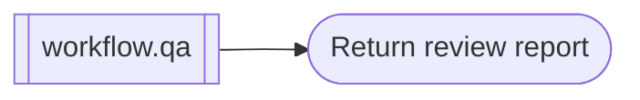

# Review workflow

```phenix-workflow
id: workflow.review
description: Run the invariant read-only review and deterministic evidence pipeline exposed by workflow.qa under a task-oriented review route.
input: request.objective
output: outcome.qa-report
entry: review
timeout-ms: 3000000
max-node-runs: 4
max-parallelism: 1
```

## Flow



## States

### review

```phenix-state
kind: invoke
title: Run the complete review pipeline
run: workflow.qa
input: input.identity
input-schema: request.objective
output-schema: outcome.qa-report
wait: await
```

### return

```phenix-state
kind: return
output: review.output
output-schema: outcome.qa-report
```

## Transitions

| From | To | When | Max traversals |
|---|---|---|---|
| `review` | `return` | | |

## Tests

### read-only-review

```phenix-test
{
  "input": { "objective": "Review the current implementation" },
  "mocks": {
    "checks": [{ "return": [{ "command": "devenv test", "ok": true, "summary": "passed" }] }],
    "fanout": [{ "return": { "objective": "Review the current implementation" } }],
    "repo": [{ "return": { "summary": "Repository review passed", "evidence": [{ "path": "src/file.ts", "finding": "structure is consistent" }], "risks": [] } }],
    "tests": [{ "return": { "summary": "Checks passed", "checks": [{ "command": "devenv test", "ok": true, "summary": "passed" }], "findings": [], "evidence": ["devenv test passed"] } }],
    "architecture": [{ "return": { "summary": "Architecture review passed", "findings": [] } }],
    "security": [{ "return": { "summary": "Security review passed", "findings": [] } }],
    "synthesize": [{ "return": { "summary": "Review complete", "checks": [{ "command": "devenv test", "ok": true, "summary": "passed" }], "findings": [], "reports": [] } }]
  },
  "expect": { "status": "success" }
}
```
