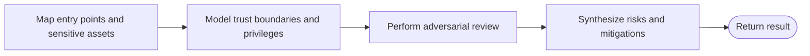

# Security workflow

```phenix-workflow
id: workflow.security
description: Map exposed surfaces and trust boundaries, perform an adversarial review, and synthesize evidence-backed risks and mitigations without automatic mutation.
input: request.objective
output: outcome.base
entry: surface
timeout-ms: 3600000
max-node-runs: 10
max-parallelism: 1
```

## Flow



## States

### surface

```phenix-state
kind: invoke
title: Map entry points, assets, and privilege boundaries
run: agent.scout
input: security.surface.input
input-schema: request.scout
output-schema: outcome.scout-report
wait: await
difficulty: D2
retry: retryable
max-retries: 1
```

### threat-model

```phenix-state
kind: invoke
title: Model ownership, trust boundaries, and attack paths
run: agent.architect
input: security.threat-model.input
input-schema: request.critic
output-schema: outcome.critic-report
wait: await
difficulty: D3
retry: retryable
max-retries: 1
```

### adversarial

```phenix-state
kind: invoke
title: Validate concrete security risks adversarially
run: agent.critic
input: security.adversarial.input
input-schema: request.critic
output-schema: outcome.critic-report
wait: await
difficulty: D3
retry: retryable
max-retries: 1
```

### finalize

```phenix-state
kind: invoke
title: Produce the security handoff
run: agent.finalizer
input: security.finalize.input
input-schema: request.objective
output-schema: outcome.base
wait: await
difficulty: D3
retry: retryable
max-retries: 1
```

### return

```phenix-state
kind: return
output: security.output
output-schema: outcome.base
```

## Transitions

| From | To | When | Max traversals |
|---|---|---|---|
| `surface` | `threat-model` | | |
| `threat-model` | `adversarial` | | |
| `adversarial` | `finalize` | | |
| `finalize` | `return` | | |

## Tests

### evidence-backed-threat-review

```phenix-test
{
  "input": { "objective": "Review command execution trust boundaries" },
  "mocks": {
    "surface": [{ "return": { "summary": "Execution surfaces mapped", "evidence": [{ "path": "src/commands.ts", "finding": "untrusted input reaches command construction" }], "risks": ["privilege escalation"] } }],
    "threat-model": [{ "return": { "summary": "Trust boundary modeled", "findings": [{ "severity": "high", "title": "untrusted command input", "evidence": "caller-controlled value crosses into execution authority" }] } }],
    "adversarial": [{ "return": { "summary": "Concrete path validated", "findings": [{ "severity": "high", "title": "unsafe command construction", "evidence": "input is not structurally parsed before execution" }] } }],
    "finalize": [{ "return": { "summary": "Security review complete", "artifacts": [], "unresolved": [] } }]
  },
  "expect": { "status": "success", "counts": { "surface": 1, "threat-model": 1, "adversarial": 1, "finalize": 1, "return": 1 } }
}
```
