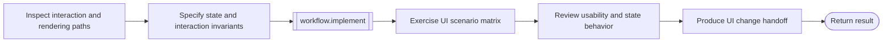

# UI change workflow

```phenix-workflow
id: workflow.ui-change
description: Specify interaction invariants, assess state and layout ownership, implement the change, exercise scenario coverage, and review the resulting user experience across UI frameworks.
input: request.objective
output: outcome.base
entry: inspect
timeout-ms: 6000000
max-node-runs: 14
max-parallelism: 1
```

## Flow



## States

### inspect

```phenix-state
kind: invoke
title: Inspect interaction, rendering, and state paths
run: agent.scout
input: ui-change.inspect.input
input-schema: request.scout
output-schema: outcome.scout-report
wait: await
difficulty: D2
retry: retryable
max-retries: 1
```

### design

```phenix-state
kind: invoke
title: Specify layout, focus, input, and update invariants
run: agent.architect
input: ui-change.design.input
input-schema: request.critic
output-schema: outcome.critic-report
wait: await
difficulty: D3
retry: retryable
max-retries: 1
```

### implement

```phenix-state
kind: invoke
title: Implement the UI change
run: workflow.implement
input: ui-change.implement.input
input-schema: request.implementation
output-schema: outcome.implementation-result
wait: await
```

### scenarios

```phenix-state
kind: invoke
title: Exercise framework-appropriate UI scenarios
run: agent.tester
input: ui-change.scenarios.input
input-schema: request.test
output-schema: outcome.test-report
wait: await
difficulty: D3
retry: retryable
max-retries: 1
```

### critique

```phenix-state
kind: invoke
title: Review interaction quality and state consistency
run: agent.critic
input: ui-change.critique.input
input-schema: request.critic
output-schema: outcome.critic-report
wait: await
difficulty: D3
retry: retryable
max-retries: 1
```

### finalize

```phenix-state
kind: invoke
title: Produce the UI change handoff
run: agent.finalizer
input: ui-change.finalize.input
input-schema: request.objective
output-schema: outcome.base
wait: await
difficulty: D2
retry: retryable
max-retries: 1
```

### return

```phenix-state
kind: return
output: ui-change.output
output-schema: outcome.base
```

## Transitions

| From | To | When | Max traversals |
|---|---|---|---|
| `inspect` | `design` | | |
| `design` | `implement` | | |
| `implement` | `scenarios` | | |
| `scenarios` | `critique` | | |
| `critique` | `finalize` | | |
| `finalize` | `return` | | |

## Tests

### interaction-scenario-matrix

```phenix-test
{
  "input": { "objective": "Improve focus and scrolling behavior" },
  "mocks": {
    "inspect": [{ "return": { "summary": "Interaction paths inspected", "evidence": [{ "path": "src/ui.ts", "finding": "selection and viewport state are coupled" }], "risks": ["stale asynchronous update"] } }],
    "design": [{ "return": { "summary": "Interaction invariants specified", "findings": [{ "severity": "medium", "title": "coupled viewport state", "evidence": "selection changes overwrite scroll ownership" }] } }],
    "scenarios": [{ "return": { "summary": "Scenario matrix passed", "checks": [{ "command": "devenv test", "ok": true, "summary": "passed" }], "findings": [], "evidence": ["focus, resize, and scrolling scenarios pass"] } }],
    "critique": [{ "return": { "summary": "Interaction behavior is consistent", "findings": [] } }],
    "finalize": [{ "return": { "summary": "UI change complete", "artifacts": [], "unresolved": [] } }]
  },
  "expect": { "status": "success" }
}
```
