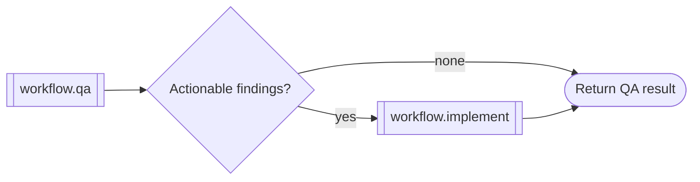

# QA and fix workflow

```phenix-workflow
id: workflow.qa-fix
description: Run QA, invoke the implementation workflow only for actionable findings, and return one final report.
input: request.objective
output: outcome.final-report
entry: qa
timeout-ms: 4800000
max-node-runs: 12
max-parallelism: 1
```

## Flow



## States

### qa

```phenix-state
kind: invoke
title: Run the complete QA workflow
run: workflow.qa
input: input.identity
input-schema: request.objective
output-schema: outcome.qa-report
wait: await
```

### route

```phenix-state
kind: decision
decide: qa-fix.next
```

### implement

```phenix-state
kind: invoke
title: Repair actionable QA findings
run: workflow.implement
input: qa-fix.implement.input
input-schema: request.implementation
output-schema: outcome.implementation-result
wait: await
```

### return

```phenix-state
kind: return
output: qa-fix.output
output-schema: outcome.final-report
```

## Transitions

| From | To | When | Max traversals |
|---|---|---|---|
| `qa` | `route` | | |
| `route` | `return` | `qa-fix.no-action` | |
| `route` | `implement` | `qa-fix.actionable` | |
| `implement` | `return` | | |
